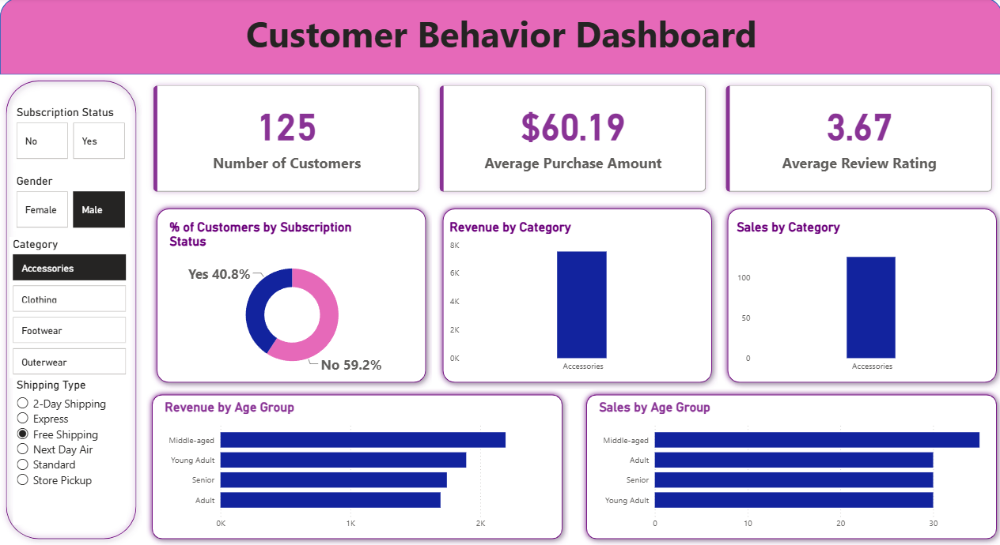

<B><strong>Retail Consumer Behavior Analysis</strong></B>

<B><strong>Project Overview</strong></B>

This project analyzes retail customer shopping behavior using Python, SQL, and Power BI to uncover customer trends, purchasing patterns, and business insights for data-driven decision-making.

<B><strong>Dashboard Preview</strong></B>

<B><strong>Key Insights</strong></B>

- Total Customers: 125
- Average Purchase Amount: $60.19
- Average Review Rating: 3.67
- Subscription Status Analysis
- Revenue by Category
- Sales by Category
- Revenue by Age Group
- Sales by Age Group

<B><strong>Repository Contents</strong></B>

- Customer_Shopping_Behavior_Analysis.ipynb
- customer_behavior_sql_queries.sql
- customer_behavior_dashboard.pbix
- customer_shopping_behavior.csv
- Business Problem Document.pdf
- Customer Shopping Behavior Analysis.pdf

<B><strong>Project Documents</strong></B>

- [Business Problem Document](https://github.com/tufailsarovar/customer-trends-data-analysis-SQL-Python-PowerBI/blob/main/Business_Problem%20_Document.pdf)
- [Customer Shopping Behavior Analysis Report](https://github.com/tufailsarovar/customer-trends-data-analysis-SQL-Python-PowerBI/blob/main/Customer_Shopping_Behavior_Analysis.pdf)

